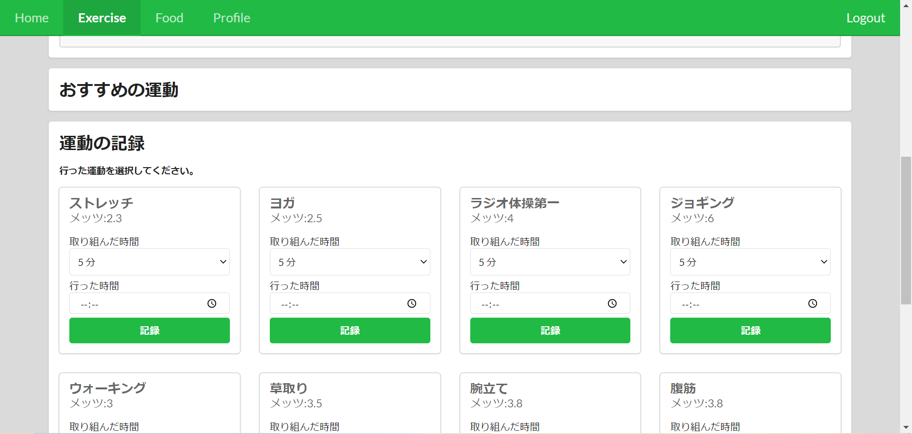

# サニタス

### [サニタスアプリのサイト](http://team1-final-internship.s3-website-ap-northeast-1.amazonaws.com)

※こちらのサイトは 2021/9/30 で閉じられます。

## 画面のスクリーンショット

Home

Exercise

Food 上部

Food 下部

Profile

## 説明

個人の体に合った身体管理を行うことができます。身体情報から分析し、食生活や運動メニューを提案します。

## 機能

- ログイン
- サインイン
- 食事の記録
- 運動を記録
- 身体情報から各種値(BMI など)の計算

---

## ライセンス

- このプロジェクトは 株式会社エムティーアイ(MTI Ltd.) の夏インターンシップで作成されたものです。
- 商用利用不可

 この 作品 は <a rel="license" href="http://creativecommons.org/licenses/by-nc-nd/4.0/">クリエイティブ・コモンズ 表示 - 非営利 - 改変禁止 4.0 国際 ライセンス</a>の下に提供されています。
